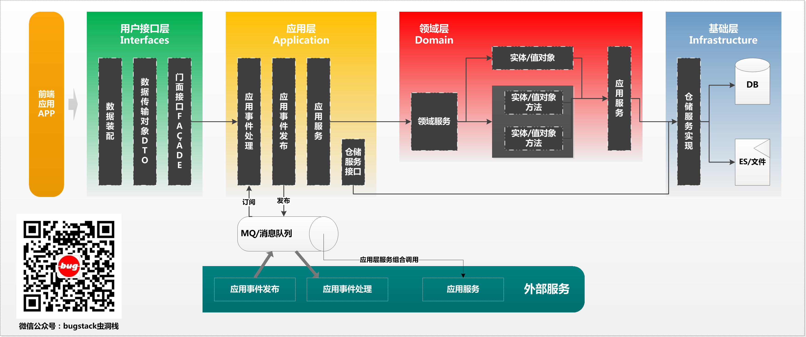
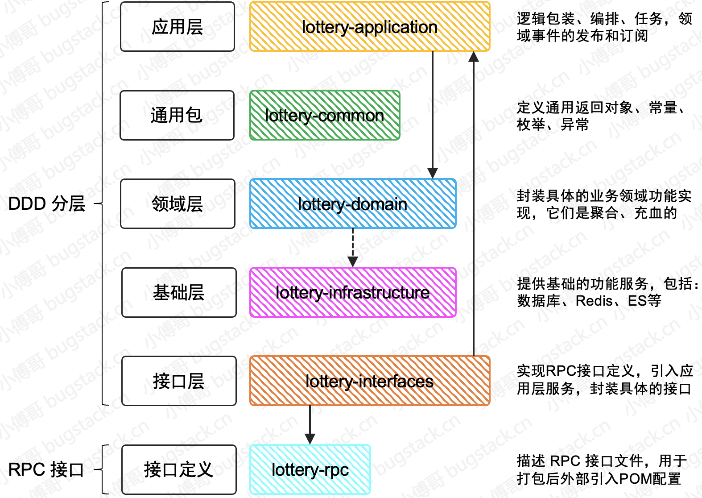

# 搭建DDD四层架构

## DDD服务架构调用关系

- 应用层{application}

    - 应用服务位于应用层。用来表述应用和用户行为，负责服务的组合、编排和转发，负责处理业务用例的执行顺序以及结果的拼装。 
    - 应用层的服务包括应用服务和领域事件相关服务。 
    - 应用服务可对微服务内的领域服务以及微服务外的应用服务进行组合和编排，或者对基础层如文件、缓存等数据直接操作形成应用服务，对外提供粗粒度的服务。 
    - 领域事件服务包括两类：领域事件的发布和订阅。通过事件总线和消息队列实现异步数据传输，实现微服务之间的解耦。

- 领域层{domain}

    - 领域服务位于领域层，为完成领域中跨实体或值对象的操作转换而封装的服务，领域服务以与实体和值对象相同的方式参与实施过程。 
    - 领域服务对同一个实体的一个或多个方法进行组合和封装，或对多个不同实体的操作进行组合或编排，对外暴露成领域服务。领域服务封装了核心的业务逻辑。实体自身的行为在实体类内部实现，向上封装成领域服务暴露。 
    - 为隐藏领域层的业务逻辑实现，所有领域方法和服务等均须通过领域服务对外暴露。 
    - 为实现微服务内聚合之间的解耦，原则上禁止跨聚合的领域服务调用和跨聚合的数据相互关联。

- 基础层{infrastructure}

    - 基础服务位于基础层。为各层提供资源服务（如数据库、缓存等），实现各层的解耦，降低外部资源变化对业务逻辑的影响。 
    - 基础服务主要为仓储服务，通过依赖反转的方式为各层提供基础资源服务，领域服务和应用服务调用仓储服务接口，利用仓储实现持久化数据对象或直接访问基础资源。

- 接口层{interfaces}

    - 接口服务位于用户接口层，用于处理用户发送的Restful请求和解析用户输入的配置文件等，并将信息传递给应用层。

综上，就是对 DDD 领域驱动设计的一个基本描述，不过也不用过于神秘化DDD，我们可以把DDD四层架构和MVC三层架构架构理解为家里的格局，三居和四居，只不过DDD是在MVC的基础上可以更加明确了房间的布局，可能效果上就像你原来有个三居中没有独立的书房，现在四居了你可以有一个自己的小空间了。
那么，这里还有一点就是DDD结构它是一种充血模型结构，所有的服务实现都以领域为核心，应用层定义接口，领域层实现接口，领域层定义数据仓储，基础层实现数据仓储中关于DAO和Redis的操作，但同时几方又有互相的依赖。那么这样的结构再开发独立领域提供 http 接口时候，并不会有什么问题体现出来。但如果这个时候需要引入 RPC 框架，就会暴露问题了，因为使用 RPC 框架的时候，需要对外提供描述接口信息的 Jar 让外部调用方引入才可以通过反射调用到具体的方法提供者，那么这个时候，RPC 需要暴露出来，而 DDD 的系统结构又比较耦合，怎么进行模块化的分离就成了问题点。所以我们本章节在模块系统结构搭建的时候，也是以解决此项问题为核心进行处理的。

## DDD + RPC，模块分离系统搭建

如果按照模块化拆分，那么会需要做一些处理，包括：

1. 应用层，不再给领域层定义接口，而是自行处理对领域层接口的包装。否则领域层既引入了应用层的Jar，应用层也引入了领域层的Jar，就会出现循环依赖的问题。
2. 基础层中的数据仓储的定义也需要从领域层剥离，否则也会出现循环依赖的问题。
3. RPC 层定义接口描述，包括：入参Req、出参Res、DTO对象，接口信息，这些内容定义出来的Jar给接口层使用，也给外部调用方使用。

## 知识点
1. 学习源码理解 DDD 结构分层
2. 知晓各个模块分层要完成的职责
3. 知道为什么要把 RPC 层单独拆分出来

